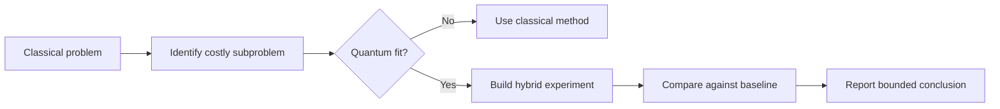

# Chapter 00: Foundation - Classical vs Quantum, History, and AI Future

## Plain-English First
This chapter gives you the big picture first. You will learn what quantum computing is, how it evolved, and where it can realistically help AI workflows.

## How to Use This Chapter
Read this chapter first, then move to [Notebook 01](../notebooks/beginner/notebook-01-qubits-and-intuition.ipynb) for the hands-on practice that follows the foundation.

## Quick Terms in this Chapter
| Term | Simple meaning |
|---|---|
| Classical computing | Uses bits that are either 0 or 1 |
| Quantum computing | Uses qubits with probabilistic outcomes |
| Hybrid workflow | Classical pipeline with a quantum subroutine |
| Benchmark | A structured test with measurable results |

## What You Should Remember in 30 Seconds
1. Know the core terms before running experiments.
2. Use repeated runs and clear thresholds for decisions.
3. Report both quality and cost, not quality alone.

## Visual Learning Map

Before Chapter 01, learners should understand three things:
1. How classical computing differs from quantum computing.
2. How quantum computing evolved historically.
3. Where quantum could help AI when classical scaling becomes expensive.

This is a pre-chapter and does not change the 12 core chapter roadmap.

## What Quantum Computing Is and Is Not
Quantum computing uses physical systems whose states follow quantum mechanics. It is not a faster version of a laptop for every task. A quantum program prepares a quantum state, applies controlled transformations, and samples measurement outcomes. The useful result is usually a probability distribution or an estimate derived from many samples, not one deterministic answer from one execution.

A classical bit is stored as either 0 or 1. A qubit can be prepared in a state that assigns amplitudes to both basis states. Measurement still returns an ordinary classical 0 or 1. This distinction matters: superposition does not mean a qubit can reveal both values at once.

Quantum advantage is therefore task-specific. A credible claim must state the task, input size, quality metric, classical baseline, resource budget, and whether the comparison used ideal simulation or real hardware.

## Classical computing vs quantum computing

### Conceptual and practical comparison

| Dimension | Classical computing | Quantum computing |
|---|---|---|
| Information unit | Bit (0 or 1) | Qubit (superposition of 0 and 1) |
| State behavior | Deterministic state transitions | Probabilistic outcomes after measurement |
| Correlation model | Standard statistical correlation | Entanglement-based correlation |
| Core strength | General-purpose computing at scale | Specialized search, sampling, and simulation classes |
| Ecosystem maturity | Highly mature hardware and software stack | Early-stage, fast-evolving hardware and tools |
| Main bottlenecks | Energy, memory bandwidth, scaling cost | Noise, decoherence, gate error rates |
| Best near-term role | End-to-end production execution | Hybrid accelerator for selected subproblems |

## History of quantum computing in short timeline

| Period | Milestone | Why it matters |
|---|---|---|
| 1980s | Feynman proposed quantum simulation; Benioff and Deutsch formalized models | Established the core idea that quantum systems can compute differently from classical machines |
| 1994 | Shor algorithm published | Demonstrated a major theoretical speedup in a high-impact problem class |
| 1996 | Grover algorithm published | Showed quadratic speedup for unstructured search |
| 2000s | Early hardware experiments | Exposed practical constraints: noise, short coherence, limited scale |
| 2010s | Cloud quantum platforms expanded | Made quantum development accessible to learners and researchers |
| 2019 onward | Quantum advantage claims and benchmark scrutiny | Shifted focus from hype to reproducibility and utility |
| Today | Hybrid quantum-classical workflows | Most realistic path for practical value in near-term systems |

## Why AI cares about this

### The AI compute pressure reality
Modern AI growth is constrained by:
1. Training cost and energy usage.
2. Memory bandwidth bottlenecks.
3. Diminishing returns from brute-force scaling.
4. Data movement and inference latency constraints.

Quantum computing is not a drop-in GPU replacement. Instead, it is a potential accelerator for specific subproblems in AI pipelines.

### A practical decision rule
Before considering a quantum approach, ask four questions:
1. Is the expensive part of the workflow a clearly isolated optimization, sampling, or physics-simulation subproblem?
2. Is there a strong classical baseline that can be measured under the same quality and budget constraints?
3. Can the quantum circuit fit the available qubits, depth, and shot budget?
4. Would a modest improvement in this subproblem change the end-to-end workflow outcome?

If any answer is no, treat the quantum idea as a research experiment rather than a production acceleration claim.

## Practical examples: where quantum can assist AI workflows

| AI workflow area | Classical challenge | Quantum-assisted pattern | Practical value | Real example |
|---|---|---|---|---|
| Combinatorial optimization | Routing, scheduling, and constrained assignment can be expensive | QAOA-style candidate generation with classical refinement | Better candidate sets for downstream solvers | Logistics and portfolio-style optimization pilots using quantum-inspired or hybrid solvers |
| Kernel-based classification | Nonlinear feature interactions can be costly to represent | Quantum feature maps plus classical SVM evaluation | Alternative embedding geometry for specific datasets | Small-scale research demos on binary classification with quantum kernels |
| Probabilistic sampling | Hard sampling steps in probabilistic models can bottleneck | Quantum circuits used for sampling subroutines | Potential exploration benefits in narrow settings | Toy Boltzmann-style and sampling studies in hybrid ML research |
| Molecular feature generation for AI | High-fidelity chemistry simulation is expensive classically | VQE-like methods for molecular energy estimation feeding AI models | Better scientific descriptors for materials or drug models | Early-stage workflows in pharma and materials research ecosystems |

Note: Every claimed gain must be tested against tuned classical baselines under the same budget and quality constraints.

## Real-world examples and realism

| Organization or ecosystem | What they did | Relevance to AI and bigger compute needs | Practical takeaway for learners |
|---|---|---|---|
| IBM Quantum ecosystem | Provided cloud access, SDKs, and benchmark tooling for hybrid workflows | Lets teams test whether quantum subroutines help selected AI-adjacent tasks | Start with simulator-first design, then validate on hardware selectively |
| Google quantum research efforts | Explored benchmark problems and hardware progress under strict evaluation | Highlights that performance claims must be tied to precise tasks and metrics | Learn to report task scope, baseline, runtime, and error characteristics |
| IonQ, Rigetti, and related hardware platforms | Enabled near-term experiments on NISQ hardware through cloud access | Shows how hardware constraints shape algorithm and evaluation design | Treat hardware runs as controlled experiments, not guaranteed speedups |
| Pharmaceutical and materials R and D pilots | Investigated hybrid quantum workflows for molecular property estimation | AI pipelines in science may benefit from improved physical features | Target domain problems where simulation quality matters more than raw throughput |

Bottom line:
1. GPUs remain the primary engine for mainstream AI training and inference.
2. Quantum is currently a specialist co-processor candidate for narrow bottlenecks.
3. The winning near-term strategy is hybrid design plus strict benchmark discipline.

## Important realism section
1. GPUs are still dominant for mainstream AI training and inference.
2. Quantum hardware today has noise, limited qubits, and execution constraints.
3. Short-term wins are expected in narrow hybrid workloads, not full model training replacement.
4. Evaluation discipline is essential: utility claims must be reproducible and compared to tuned classical baselines.

## Suggested practical exercises for this foundation chapter
1. Reading exercise:
- Identify one AI task in your domain and classify whether it is optimization-heavy, sampling-heavy, or dense linear algebra heavy.

2. Benchmark thought experiment:
- For your task, define baseline metrics: runtime, quality score, energy estimate, and reproducibility index.

3. Hybrid architecture sketch:
- Draw a workflow where classical pipeline handles 90 to 99 percent and quantum handles one bottleneck subroutine.

## Reference Materials
Use these clickable sources when you want the original definitions and background:
1. [Qiskit Learn](https://qiskit.qotlabs.org/learn) - beginner-friendly quantum computing lessons and examples.
2. [Qiskit API Reference](https://qiskit.qotlabs.org/docs/api/qiskit/) - definitions for circuit objects and core SDK concepts.
3. [IBM Quantum Documentation](https://docs.quantum.ibm.com/) - official platform and hardware background.
4. [NIST Quantum Information Science](https://www.nist.gov/programs-projects/quantum-information-science) - standards and overview material.

## Bridge to Chapter 01
Chapter 01 starts with qubits and state intuition, where this foundation becomes hands-on with the first simulator experiment.
