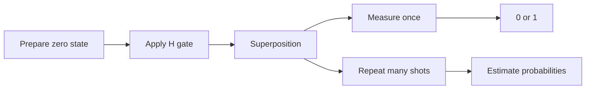

# Chapter 01: Qubits and State Intuition

## Plain-English First
A qubit is like a flexible information unit. In this chapter you will see how one qubit can produce different outcomes and why repeated measurement matters.

## How to Use This Chapter
Read this chapter first, then open [Notebook 01](../notebooks/beginner/notebook-01-qubits-and-intuition.ipynb) to practice superposition and measurement with code.

## Quick Terms in this Chapter
| Term | Simple meaning |
|---|---|
| Qubit | Basic quantum information unit |
| Superposition | Combination of basis states before measurement |
| Measurement | Process that returns classical output |
| Shots | Number of repeated runs |

## Evaluation Lens
Is the measured distribution consistent with the state the circuit was intended to prepare, after accounting for finite-shot variation?

## Visual Learning Map


## 1-minute overview
A qubit is the basic unit of quantum information. Unlike a classical bit that is either 0 or 1, a qubit can be in a superposition of both states.

## Build the Qubit Model Step by Step

A classical bit has two allowed values. A qubit also has two standard measurement outcomes, called the **computational basis** states $|0\rangle$ and $|1\rangle$. Before measurement, however, a qubit is described by a state vector:

$$
|\psi\rangle=\alpha|0\rangle+\beta|1\rangle
$$

The coefficients $\alpha$ and $\beta$ are complex amplitudes. They obey the normalization rule:

$$
|\alpha|^2+|\beta|^2=1
$$

This rule ensures that the total probability of all possible measurement outcomes is one. A useful beginner habit is to separate three ideas:

| Object | Meaning | Example |
|---|---|---|
| Basis state | A state named by one measurement outcome | $|0\rangle$ or $|1\rangle$ |
| Amplitude | Complex coefficient used to calculate probability | $\alpha=1/\sqrt{2}$ |
| Probability | Squared amplitude magnitude | $P(0)=|\alpha|^2$ |

The state $|0\rangle$ has amplitudes $(1,0)$ and always produces 0 in the computational basis. The state $|1\rangle$ has amplitudes $(0,1)$ and always produces 1. The equal-superposition state has amplitudes $(1/\sqrt{2},1/\sqrt{2})$, which produces each outcome with probability $1/2$.

## From Amplitudes to Outcomes
The symbols $\alpha$ and $\beta$ are amplitudes, not probabilities. An amplitude can be negative or complex, so it cannot be read directly as a chance. The probability of measuring 0 is $|\alpha|^2$ and the probability of measuring 1 is $|\beta|^2$.

For example, the equal-superposition state is:

$$
|+\rangle=\frac{|0\rangle+|1\rangle}{\sqrt{2}}
$$

Both amplitudes have magnitude $1/\sqrt{2}$, so each measurement outcome has probability $1/2$. Repeating the same circuit estimates these probabilities; it does not reveal the unmeasured state of an individual qubit.

### Why phase is deferred, not irrelevant
States such as $(|0\rangle+|1\rangle)/\sqrt{2}$ and $(|0\rangle-|1\rangle)/\sqrt{2}$ produce the same 50/50 result when measured immediately. They are nevertheless different states because later gates can make their phase difference visible through interference. Chapter 02 introduces the gates that create and use this effect.

## The Bloch Sphere: One Picture for Every Pure Qubit

Ignoring global phase, every single-qubit pure state can be written as:

$$
|\psi\rangle=\cos\left(\frac{\theta}{2}\right)|0\rangle+e^{i\phi}\sin\left(\frac{\theta}{2}\right)|1\rangle
$$

The Bloch sphere represents this state as a point on a unit sphere. The angle $\theta$ controls the relative amount of $|0\rangle$ and $|1\rangle$; the angle $\phi$ controls their relative phase. You do not need to calculate these angles for every exercise, but the picture gives the right intuition.

| Bloch-sphere location | State | Meaning in a computational-basis measurement |
|---|---|---|
| North pole | $\lvert 0\rangle$ | Always 0 |
| South pole | $\lvert 1\rangle$ | Always 1 |
| Positive x-axis | $\lvert{+}\rangle=(\lvert 0\rangle+\lvert 1\rangle)/\sqrt{2}$ | 50/50 |
| Negative x-axis | $\lvert{-}\rangle=(\lvert 0\rangle-\lvert 1\rangle)/\sqrt{2}$ | 50/50 |

The last two rows are the key lesson: position around the equator represents phase information that a direct computational-basis measurement cannot reveal.

### Global phase versus relative phase

Multiplying an entire state by the same complex factor does not change any measurement probability. For example, $|+\rangle$ and $- |+\rangle$ describe the same physical state; this is a **global phase**. In contrast, changing only one component changes the relative phase: $|+\rangle$ becomes $|-\rangle$. Relative phase can alter interference after later gates, so it is physically observable.

## Measurement Depends on the Chosen Basis

Measuring in the computational, or Z, basis distinguishes $|0\rangle$ from $|1\rangle$. It cannot distinguish $|+\rangle$ from $|-\rangle$ in one shot because both yield 0 and 1 with equal probability. Applying an H gate before a standard measurement changes the effective measurement basis to the X basis:

$$
H|+\rangle=|0\rangle,\qquad H|-\rangle=|1\rangle
$$

This is not a trick. The circuit asks a different question of the same state. A measurement result is meaningful only alongside the basis in which it was measured.

## The Circuit Chain: One Path Through the Bloch Sphere

This three-step sequence is the most productive single experiment in the beginner tier. Each step is one gate, and the chain visits four distinct named states:

```
|0⟩  --H-->  |+⟩  --Z-->  |-⟩  --H-->  |1⟩
```

| Step | Gate | Input | Output | Bloch-sphere movement |
|---|---|---|---|---|
| 1 | H | $\lvert 0\rangle$ (north pole) | $\lvert{+}\rangle$ (positive x) | Rotates from Z axis to X axis |
| 2 | Z | $\lvert{+}\rangle$ (positive x) | $\lvert{-}\rangle$ (negative x) | Flips around Z axis, changes relative phase |
| 3 | H | $\lvert{-}\rangle$ (negative x) | $\lvert 1\rangle$ (south pole) | Rotates from X axis to south pole |

After step 1, a Z-basis measurement gives 50/50. After step 2, a Z-basis measurement still gives 50/50. The phase change from step 2 is only visible after the H gate in step 3 turns it into a population difference. This is interference made concrete.

**What each line does:**
- `QuantumCircuit(1, 1)` — one qubit, one classical bit to store the result.
- `qc.h(0)` — puts the qubit into equal superposition; Bloch-sphere point moves from north pole to positive-x.
- `qc.z(0)` — flips the relative phase; the point moves to negative-x. The Z-basis counts are still 50/50 here.
- `qc.h(0)` — converts the phase difference back into a population difference; now the qubit points at the south pole.
- `qc.measure(0, 0)` — collapses the quantum state and writes 0 or 1 to classical bit 0.
- `shots=1024` — the whole circuit is repeated 1024 times and outcomes are tallied.

```python
from qiskit import QuantumCircuit
from qiskit_aer import AerSimulator

qc = QuantumCircuit(1, 1)
qc.h(0)   # |0⟩ -> |+⟩
qc.z(0)   # |+⟩ -> |-⟩
qc.h(0)   # |-⟩ -> |1⟩
qc.measure(0, 0)

counts = AerSimulator().run(qc, shots=1024).result().get_counts()
print(counts)  # expect: {'1': ~1024}
```

**Reading the output:** `counts` is a dictionary such as `{'1': 1024}`. A result of all 1s confirms that the Z gate changed the relative phase in a way that only became visible after the second H gate. If you see a mixed result like `{'0': 512, '1': 512}`, the Z gate is either missing or the bit order is reversed.

## Interference Experiment: States That Initially Look the Same

The following two circuits produce the same 50/50 distribution if measured immediately after their first H gate. Add a second H gate, however, and their relative phase becomes visible.

**What the function does:** `counts_for(relative_phase=False)` runs `H → measure`; `counts_for(relative_phase=True)` runs `H → Z → H → measure`. The Z gate is the only difference.

```python
from qiskit import QuantumCircuit
from qiskit_aer import AerSimulator

def counts_for(relative_phase):
    qc = QuantumCircuit(1, 1)
    qc.h(0)
    if relative_phase:
        qc.z(0)      # inserts a relative-phase flip between the two H gates
    qc.h(0)          # second H converts phase difference into population difference
    qc.measure(0, 0)
    return AerSimulator().run(qc, shots=1024).result().get_counts()

print("plus state:", counts_for(relative_phase=False))
print("minus state:", counts_for(relative_phase=True))
```

**Reading the output:**
- `plus state: {'0': ~1024}` — H applied twice to |0⟩ returns to |0⟩. No phase flip, so all shots land on 0.
- `minus state: {'1': ~1024}` — the Z gate changed the relative phase, which the second H gate converts to a definite 1.

If you remove the second H gate, both calls return approximately `{'0': 512, '1': 512}` — the phase difference becomes invisible. That is the core lesson: **phase only matters when it is converted to a population difference by a gate**.

Expected result: the first circuit produces 0 and the second produces 1, apart from any intentionally introduced noise. This is interference: amplitudes combine before probabilities are calculated.


## Why this matters for evaluation
Evaluation starts with understanding expected probabilities. If a circuit should produce 50/50 outcomes but gives 80/20 repeatedly, your circuit setup, measurement mapping, or noise assumptions require investigation. One 80/20 sample at a very low shot count is not enough evidence; a persistent deviation across repeats is.

## Practical example
Goal: create a qubit in superposition and measure outcomes.

**What each line does:**
- `QuantumCircuit(1, 1)` — creates a circuit with one qubit and one classical bit.
- `qc.h(0)` — applies the Hadamard gate to qubit 0, creating the equal-superposition state |+⟩.
- `qc.measure(0, 0)` — measures qubit 0 and stores the result (0 or 1) in classical bit 0.
- `sim.run(qc, shots=1024)` — repeats the full prepare-and-measure cycle 1024 times.
- `get_counts()` — returns how many times each outcome (0 or 1) was observed across all shots.

```python
from qiskit import QuantumCircuit
from qiskit_aer import AerSimulator

qc = QuantumCircuit(1, 1)
qc.h(0)             # put qubit in equal superposition
qc.measure(0, 0)

sim = AerSimulator()
job = sim.run(qc, shots=1024)
counts = job.result().get_counts()
print(counts)
```

**Reading the output:** You will see something like `{'0': 508, '1': 516}`. The two counts will not be exactly equal because each shot is a random draw from a 50/50 distribution. A result close to even is expected. A strongly skewed result — for example `{'0': 900, '1': 124}` — would indicate a circuit error, wrong gate, or measurement mapping problem worth investigating.

Expected behavior: counts close to 50 percent 0 and 50 percent 1.

## Evaluation table

| Metric | Target | Example pass rule |
|---|---|---|
| p(0) and p(1) balance | Near 0.5 each | At 1024 shots, $\lvert p(0)-p(1)\rvert \leq 0.10$ |
| Repeatability | Stable across repeats | Run 5 repeats, max deviation <= 0.08 |
| Cost discipline | Reasonable shot budget | Start at 512, then 1024 or 2048 if needed |

## Real-world example
In quantum random number generation workflows, balanced outcome behavior is a first sanity check before any downstream usage. If the observed distribution is strongly biased without explanation, the setup requires investigation.

## Expert checkpoint
1. Record 5 repeated runs at 1024 shots and report mean p(1).
2. Report the observed range and whether it passes your threshold.
3. Explain whether your pass decision is based on one run or repeated evidence.

## Checkpoint
1. Explain in your own words why repeated measurement is needed.
2. What happens if you remove the H gate?
3. Run with shots 128 and 4096, then compare stability.

## Common mistakes
1. Assuming one measurement run is enough.
2. Confusing amplitude with probability.
3. Ignoring shot count when interpreting results.
4. Making claims without documenting thresholds and repeat count.

## Failure Modes
1. **Wrong measurement basis:** a 50/50 result can be correct in the Z basis while hiding a meaningful phase difference.
2. **Invalid state preparation:** amplitudes that do not satisfy $|\alpha|^2+|\beta|^2=1$ cannot represent a valid isolated qubit state.
3. **Global-phase confusion:** treating $|\psi\rangle$ and $e^{i\gamma}|\psi\rangle$ as different physical states leads to false distinctions.
4. **Interpreting counts as the full state:** counts from one basis do not reveal relative phase or prove that a state is correct for later interference.

## Next chapter
Gates and circuits: how we control qubit states deliberately.
