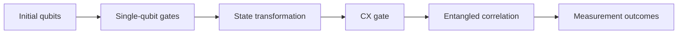

# Chapter 02: Gates and Circuits

## Plain-English First
A circuit is a sequence of steps. Gates are individual steps that change qubit states. This chapter shows how simple gate sequences create predictable outcomes.

## How to Use This Chapter
Read this chapter first, then open [Notebook 02](../notebooks/beginner/notebook-02-gates-and-circuits.ipynb) to run the gate and circuit exercises.

## Quick Terms in this Chapter
| Term | Simple meaning |
|---|---|
| Gate | Operation that changes a qubit state |
| Circuit | Ordered set of gates plus measurement |
| Entanglement | Correlation that links qubits |
| Depth | Number of sequential operation layers |

## Evaluation Lens
Does the ordered gate sequence, including its measurement mapping, produce the expected deterministic or correlated output distribution?

## Visual Learning Map


## 1-minute overview
Quantum gates transform qubit states. A quantum circuit is an ordered set of gates plus measurement.

## Core gates in this chapter
1. X gate: flips $|0\rangle$ to $|1\rangle$
2. H gate: creates superposition
3. Z gate: phase flip (important in interference patterns)
4. CX gate: two-qubit entangling gate

## Gates Change States, Not Just Labels
Quantum gates are reversible linear transformations. Unlike an ordinary assignment such as “set the bit to 1,” a gate preserves enough information that its action can be reversed. For the gates used here:

$$
X|0\rangle=|1\rangle,\qquad X|1\rangle=|0\rangle
$$

$$
H|0\rangle=\frac{|0\rangle+|1\rangle}{\sqrt{2}},\qquad H|1\rangle=\frac{|0\rangle-|1\rangle}{\sqrt{2}}
$$

The $Z$ gate leaves $|0\rangle$ unchanged and changes the sign of $|1\rangle$. That sign is a phase change: it may not change an immediate measurement count, but it changes how paths interfere after later gates.

## Gates as Matrices

A single-qubit state can be represented as a two-entry column vector. A gate is a unitary matrix that multiplies that vector. For the most important gates in this chapter:

$$
X=\begin{bmatrix}0&1\\1&0\end{bmatrix},\qquad
Z=\begin{bmatrix}1&0\\0&-1\end{bmatrix},\qquad
H=\frac{1}{\sqrt{2}}\begin{bmatrix}1&1\\1&-1\end{bmatrix}
$$

For example, applying $X$ to $|0\rangle=(1,0)^T$ swaps the entries and produces $|1\rangle=(0,1)^T$. The word **unitary** means a gate preserves total probability and has an inverse. In fact, the introductory gates are self-inverse:

$$
X^2=Z^2=H^2=I
$$

This gives you a reliable circuit-debugging identity. Two X gates cancel, and two H gates cancel. A circuit that should return to its starting state but does not is often suffering from an ordering, wire, or measurement error.

### Gate order matters

Read a circuit from left to right in its diagram, but calculate state evolution by applying the rightmost matrix first. In general, $HZ \ne ZH$. Gates that do not commute cannot be reordered freely. This is why a quantum circuit is an ordered program, not merely a bag of operations.

### Circuit identities to discover

The following identities are worth verifying by running the circuit and checking counts, then by multiplying the matrices:

| Identity | Circuit meaning |
|---|---|
| $H^2=I$ | Two H gates cancel; the state returns to its starting point |
| $X^2=I$ | Two X gates cancel |
| $HZH=X$ | Sandwiching Z between two H gates produces an X gate |

The last one is the most important. It shows that the same physical operation looks like a phase flip in one basis and a bit flip in another. To verify it by circuit:

```python
from qiskit import QuantumCircuit
from qiskit_aer import AerSimulator

# HZH should flip |0> to |1>, just like X does
qc = QuantumCircuit(1, 1)
qc.h(0)
qc.z(0)
qc.h(0)
qc.measure(0, 0)

counts = AerSimulator().run(qc, shots=512).result().get_counts()
print(counts)  # expect: {'1': ~512}, same as a plain X gate
```

This identity also explains why the circuit chain in Chapter 01 ends at $|1\rangle$: the $HZH$ sequence acts like $X$ on $|0\rangle$.

### Why a small gate set is powerful

Arbitrary single-qubit rotations combined with an entangling two-qubit gate such as CX form a universal model of quantum computation: sufficiently long sequences can approximate any operation on a finite set of qubits. Universality does not make every circuit practical. Longer decompositions add depth and, on hardware, more opportunities for error.

### What entanglement adds
Apply $H$ to the first qubit and then controlled-X (CX) from the first to the second. The result is the Bell state $$(|00\rangle+|11\rangle)/\sqrt{2}$$. Each individual qubit looks random, but the pair is correlated: measuring one determines the compatible outcome of the other. Correlation alone is not proof of entanglement; the circuit preparation and measurement basis matter.

### A Bell state is not two known bits

The Bell state does not mean that each qubit secretly holds the same classical value before measurement. Each individual qubit has a random local outcome, while the pair has correlations that depend on the preparation and measurement basis. For this course, the practical check is to verify both the expected outcomes and low leakage into $01$ and $10$ under a documented measurement basis.

## Why this matters for evaluation
Evaluation often checks whether a known gate sequence produces expected output distributions. Gate-level mistakes are a major source of benchmark failure. Check bit order and measurement mapping before diagnosing a physics problem: a correctly built circuit can appear wrong if its classical output bits are read in the wrong order.

## Practical example A: deterministic flip
```python
from qiskit import QuantumCircuit
from qiskit_aer import AerSimulator

qc = QuantumCircuit(1, 1)
qc.x(0)
qc.measure(0, 0)

sim = AerSimulator()
counts = sim.run(qc, shots=512).result().get_counts()
print(counts)
```
Expected result: mostly or entirely 1.

## Practical example B: Bell state circuit
```python
from qiskit import QuantumCircuit
from qiskit_aer import AerSimulator

qc = QuantumCircuit(2, 2)
qc.h(0)
qc.cx(0, 1)
qc.measure([0, 1], [0, 1])

sim = AerSimulator()
counts = sim.run(qc, shots=1024).result().get_counts()
print(counts)
```
Expected behavior: dominant outcomes are 00 and 11.

## Evaluation table

| Circuit | Expected behavior | Suggested beginner threshold |
|---|---|---|
| X flip | Almost all results are 1 | p(1) >= 0.98 at 512 to 1024 shots |
| Bell state | 00 and 11 dominate | p(00) + p(11) >= 0.90 on simulator |
| Bell state leakage | 01 and 10 remain low | p(01) + p(10) <= 0.10 on simulator |

## Depth and cost note
When two circuits solve the same toy task, prefer the lower-depth variant for better noise resilience in later hardware experiments.

## Real-world example
Entanglement sanity checks are used in quantum communication and hardware calibration workflows where verifying correlated outcomes is a baseline quality signal.

## Expert checkpoint
1. Report circuit depth for Example A and B.
2. Repeat the Bell circuit 5 times and report p(00)+p(11) mean and min.
3. If leakage exceeds threshold, list two possible root causes.

## Checkpoint
1. Why does CX need a control and target qubit?
2. What output would you expect if H is removed from qubit 0 in the Bell circuit?
3. Modify the circuit and test your hypothesis.

## Failure Modes
1. **Gate-order error:** swapping noncommuting gates changes the state even when the gate list looks similar.
2. **Control-target confusion:** CX is directional; reversing its wires changes the operation.
3. **Bit-order misreading:** Qiskit count strings can be interpreted backward if classical-bit mapping is not recorded.
4. **False entanglement claim:** correlated Z-basis counts alone do not establish every property of an entangled state.

## Next chapter
Measurement and probabilities: how to read circuit outcomes rigorously.
