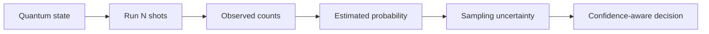

# Chapter 03: Measurement and Probabilities

## Plain-English First
Quantum outcomes are probabilistic. This chapter teaches how shot counts affect confidence and why one run is never enough for a serious claim.

## How to Use This Chapter
Read this chapter first, then open [Notebook 03](../notebooks/beginner/notebook-03-measurement-and-probabilities.ipynb) to practice sampling and probability analysis.

## Quick Terms in this Chapter
| Term | Simple meaning |
|---|---|
| Probability | Likelihood of each output state |
| Sampling variance | Natural fluctuation across repeated runs |
| Confidence | How reliable the estimated probability is |
| Repeat | One additional run of the same setup |

## Evaluation Lens
Is an observed difference large enough to matter practically, rather than merely a fluctuation from a finite number of shots?

## Visual Learning Map


## 1-minute overview
Quantum measurements are probabilistic. You do not validate a circuit from one run; you validate it from outcome distributions across many shots.

## Core concepts
1. Measurement maps quantum state to classical bits.
2. Outcome frequencies estimate probabilities.
3. More shots usually reduce sampling variance.
4. Expected distribution is your baseline for evaluation.

## Sampling: What a Shot Actually Means
One shot prepares and measures a circuit once. If an outcome has true probability $p$, then after $N$ independent shots its observed frequency $\hat{p}$ is an estimate of $p$, not the exact value. For a binary outcome, the approximate standard error is:

$$
\operatorname{SE}(\hat{p})=\sqrt{\frac{\hat{p}(1-\hat{p})}{N}}
$$

At the hardest-to-estimate point, $p=0.5$, the standard error is about $0.5/\sqrt{N}$. This means increasing shots by four cuts typical sampling error roughly in half, not by four. More shots improve precision but also increase execution cost.

### Confidence intervals and repeated runs answer different questions
A confidence interval describes uncertainty from finite sampling within one controlled run. Repeated runs also expose variation caused by changing random seeds, simulator settings, calibration drift, or hardware conditions. For a serious claim, report both the shot count and the repeat policy.

## The Binomial Model Behind a Count Histogram

For a binary measurement such as a balanced H-gate circuit, the number of observed ones $K$ follows a binomial model when shots are independent and the underlying probability is stable:

$$
K \sim \operatorname{Binomial}(N,p)
$$

The estimate is $\hat p=K/N$. A normal-approximation 95 percent interval is $\hat p \pm 1.96\operatorname{SE}(\hat p)$ when $N$ is reasonably large and the outcome is not extremely rare. For small samples or probabilities near zero or one, prefer a Wilson interval because it behaves more reliably near the boundary. The point is not to memorize one formula: report an uncertainty method appropriate to the experiment.

### Statistical difference is not automatically practical difference

With a very large number of shots, a tiny difference such as $0.500$ versus $0.508$ can become statistically detectable. That does not necessarily justify an engineering action. Define a **practical tolerance** before the experiment. For an intended balanced distribution, a team might decide that TVD below $0.02$ is operationally acceptable even when it can estimate a nonzero deviation precisely.

Use two questions in order:
1. Is the observed change unlikely under the reference model, given sampling uncertainty?
2. Is the size of that change large enough to affect the task, threshold, or downstream decision?

### Multiple comparisons need discipline

When testing many circuits, seeds, or metrics, a few unusual results occur by chance. Record the complete candidate list and selection rule before running. Do not present only the most favorable outcome as though it were the planned primary result.

## Why this matters for evaluation
Evaluation compares observed distributions against expected distributions. If expected is 50/50 and observed is far off, you investigate circuit design, noise, or execution settings.

## Practical example
```python
from qiskit import QuantumCircuit
from qiskit_aer import AerSimulator

qc = QuantumCircuit(1, 1)
qc.h(0)
qc.measure(0, 0)

sim = AerSimulator()
for shots in [128, 512, 2048]:
    counts = sim.run(qc, shots=shots).result().get_counts()
    print(shots, counts)
```

## Evaluation table

| Shot count | What to expect | Interpretation rule |
|---|---|---|
| 128 | Higher fluctuation | Useful for intuition, weak for strong claims |
| 512 | Moderate fluctuation | Good default for quick checks |
| 2048 | Lower fluctuation | Better for stable benchmark reporting |

## Statistical significance note
For a binary outcome, report either:
1. A 95 percent confidence interval, or
2. Repeated-run spread across at least 5 runs.

Simple rule for this chapter:
At 1024 or 2048 shots, do not make quality claims from one run only.

## Real-world example
In hybrid quantum machine learning experiments, researchers often reject one-off results and require repeated sampling statistics to avoid mistaking random fluctuation for model improvement.

## Checkpoint
1. Why does 128 shots fluctuate more than 2048 shots?
2. What does measurement collapse mean in practice?
3. How would you explain sampling noise to a beginner?

## Mini challenge
Run the same circuit 5 times with shots=256 and record variation in counts.

## Expert checkpoint
1. Compare variation at 256, 1024, and 2048 shots.
2. Report which shot setting gives best confidence-to-cost tradeoff.
3. State one decision you would make differently after seeing repeated-run variance.

## Failure Modes
1. **Too few shots:** a wide interval cannot support a narrow performance claim.
2. **Treating a confidence interval as repeatability:** it describes finite-shot uncertainty, not calibration drift or seed sensitivity.
3. **Practical-significance error:** acting on a tiny effect that does not cross a predefined decision threshold.
4. **Cherry-picking repeats:** reporting only the run closest to the expected distribution hides experiment variability.
