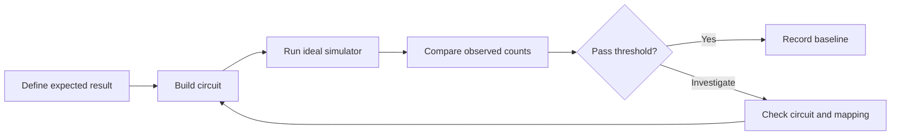

# Chapter 04: Simulator Basics and First Benchmark

## Plain-English First
You will build a simple benchmark process. The goal is to compare expected vs observed behavior with clear pass or investigate rules.

## How to Use This Chapter
Read this chapter first, then open [Notebook 04](../notebooks/beginner/notebook-04-simulator-first-benchmark.ipynb) to build the first simulator benchmark report.

## Quick Terms in this Chapter
| Term | Simple meaning |
|---|---|
| Expected distribution | Target probabilities before running |
| Observed counts | Measured outcomes after running |
| Threshold | Rule for pass or investigate |
| Decision | Evaluation outcome based on metrics |

## Evaluation Lens
Was the benchmark protocol specified before execution, and is the observed distribution within a defensible tolerance of the ideal reference?

## Visual Learning Map


## 1-minute overview
A simulator gives a controlled environment for baseline evaluation before moving to hardware.

## Benchmark goal
Evaluate whether three simple circuits behave as expected:
1. Identity circuit
2. X-gate flip circuit
3. H-gate superposition circuit

## What a Simulator Can and Cannot Prove
An ideal simulator applies the circuit model exactly. It is the right place to test circuit construction, expected distributions, bit ordering, and scoring logic. It does not demonstrate that the same circuit will perform equally well on hardware, because real devices add gate error, readout error, limited connectivity, and time-dependent calibration effects.

Use an ideal simulator as a reference baseline. Then introduce a documented noise model in Chapter 06 before interpreting a simulator result as a hardware prediction.

### A benchmark is a precommitted decision rule
A benchmark is more than running code and looking at a chart. Before execution, define the expected distribution, metric, threshold, shots, repeats, and action for pass or investigate. This avoids choosing a threshold only after seeing a favorable result.

## The Quantum Quality Control Template

Every benchmark in this course should follow this seven-field structure. Fill it out before writing any code.

| Field | What to write | Example for H-gate circuit |
|---|---|---|
| **Question** | What is being tested? | Does this circuit produce the expected balanced distribution? |
| **Hypothesis** | What does theory predict? | $P(0)=P(1)=0.5$ |
| **Protocol** | Repeats × shots, fixed settings | 5 repeats × 1024 shots, AerSimulator, no noise |
| **Metric** | How to measure agreement | TVD between observed and expected |
| **Uncertainty** | How to quantify sampling variation | 95% CI on each frequency |
| **Decision rule** | Predefined pass condition | TVD $\leq 0.05$ across all 5 repeats |
| **Action** | What to do with each outcome | Pass → record baseline. Investigate → check mapping and rerun. |

The result then fills two fields: the measured metric value with its uncertainty, and the decision it triggers. Writing these fields first transforms a run into an experiment.

## Evaluation template
For each circuit, record:
1. Expected distribution
2. Observed counts
3. Deviation notes
4. Pass or investigate

## Benchmark threshold table

| Circuit | Suggested expected behavior | Suggested pass threshold |
|---|---|---|
| identity | Mostly 0 | p(0) >= 0.98 at 1024 shots |
| x_flip | Mostly 1 | p(1) >= 0.98 at 1024 shots |
| h_superposition | Near-balanced | $\lvert p(0)-p(1)\rvert \leq 0.10$ at 1024 shots |

Use these as starter thresholds for simulator-first labs.

## Derive a Threshold Instead of Borrowing One

An ideal simulator has no physical gate or readout error, but a finite-shot experiment still varies. For a deterministic circuit with true success probability $p=1$, every sampled result should be correct in an ideal simulator; an unexpected outcome usually indicates a circuit, mapping, or analysis defect. For the H-gate circuit, the expected probability is $p=0.5$, so variation is expected.

At $N=1024$ shots, the approximate standard error for an ideal balanced circuit is $0.5/\sqrt{1024}\approx0.016$. A balance difference of $0.10$ is therefore much larger than ordinary sampling variation and is a useful investigation trigger. It is not a universal law. Choose a threshold from:
1. the expected distribution and shot count;
2. the tolerated practical error for the task; and
3. the cost of a false pass versus a false investigation.

Record this reasoning beside the threshold. That turns a benchmark from a copied rule into an auditable decision.

## Practical benchmark script
```python
from qiskit import QuantumCircuit
from qiskit_aer import AerSimulator

sim = AerSimulator()
shots = 1024

circuits = {
    "identity": QuantumCircuit(1,1),
    "x_flip": QuantumCircuit(1,1),
    "h_superposition": QuantumCircuit(1,1)
}

circuits["identity"].measure(0,0)
circuits["x_flip"].x(0)
circuits["x_flip"].measure(0,0)
circuits["h_superposition"].h(0)
circuits["h_superposition"].measure(0,0)

for name, qc in circuits.items():
    counts = sim.run(qc, shots=shots).result().get_counts()
    print(name, counts)
```

## Reporting format (required)
For each circuit report this table:

| Circuit | Depth | Shots | Expected | Observed | Max deviation | Pass decision |
|---|---:|---:|---|---|---:|---|
| identity | ... | ... | ... | ... | ... | ... |
| x_flip | ... | ... | ... | ... | ... | ... |
| h_superposition | ... | ... | ... | ... | ... | ... |

## Real-world example
This mirrors early-stage benchmark practice in cloud quantum projects, where teams standardize expected distributions, pass thresholds, and report templates before running larger algorithm studies.

## Checkpoint
1. Which circuit is deterministic and why?
2. Which circuit should be approximately balanced?
3. What threshold would you use to flag unusual results?

## Expert checkpoint
1. Run each circuit 5 times and report mean plus worst-case deviation.
2. Identify which benchmark result is most sensitive to shot count.
3. State one change that improves rigor without increasing cost too much.

## Failure Modes
1. **Post-hoc thresholding:** selecting a tolerance after seeing the counts biases the decision.
2. **Reference mismatch:** comparing a circuit against an expected distribution for a different bit order or measurement basis.
3. **False hardware inference:** treating an ideal-simulator pass as evidence of hardware readiness.
4. **Unexplained deterministic failure:** accepting a nonzero error rate for an ideal deterministic circuit without debugging its implementation.

## Next step
Move to Chapter 05 for fidelity and error metrics.
