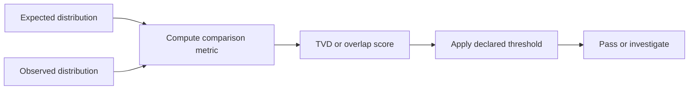

# Chapter 05: Fidelity and Quality Metrics

## Plain-English First
This chapter turns observations into scores. You will learn simple quality metrics so you can compare results objectively.

## How to Use This Chapter
Read this chapter first, then open [Notebook 05](../notebooks/intermediate/notebook-05-fidelity-and-metrics.ipynb) to compute the metrics in practice.

## Quick Terms in this Chapter
| Term | Simple meaning |
|---|---|
| Fidelity proxy | Score of similarity to expected behavior |
| TVD | Distance between expected and observed distributions |
| Overlap | Shared probability mass between distributions |
| Quality score | Numeric indicator of result quality |

## Evaluation Lens
Which metric captures the error relevant to this task, and how much of its observed value may be explained by sampling uncertainty?

## Visual Learning Map


## 1-minute overview
Fidelity measures how close your observed quantum state or outcome distribution is to the expected target.

## Why this chapter matters
After simulator sanity checks, evaluation needs a formal quality score instead of only visual inspection.

If you cannot quantify quality, you cannot compare circuits, tune designs, or justify hardware runs.

## Core concepts table

| Concept | Meaning | Practical use |
|---|---|---|
| State fidelity | Similarity between expected and observed states | Quality check for state-preparation tasks |
| Distribution distance | Gap between expected and measured outcome distributions | Useful when working with counts |
| Threshold decision | A rule that marks pass or investigate | Makes benchmarking consistent |

## Practical metrics you can compute from counts

When you only have measurement counts, start with these:

| Metric | Formula | Range | Best value |
|---|---|---|---|
| Total variation distance (TVD) | $\frac{1}{2}\sum_i |p_i-q_i|$ | $[0,1]$ | 0 |
| L1 distance | $\sum_i |p_i-q_i|$ | $[0,2]$ | 0 |
| Fidelity proxy (distribution overlap) | $\sum_i \sqrt{p_i q_i}$ | $[0,1]$ | 1 |

Where $p$ is expected distribution and $q$ is observed distribution.

## Choose the Metric That Matches What You Observed
State fidelity and distribution similarity answer related but different questions. State fidelity compares quantum states and can detect phase errors, but it normally requires a simulator, tomography, or another state-sensitive method. Counts alone discard phase information, so a count-based overlap can look perfect even when the underlying state is wrong for a later interference step.

TVD is often the best first metric for count data because it has an operational reading: it is the largest possible difference in probability assigned to any event by the two distributions. A TVD of $0.08$ means the observed distribution is close, but not identical, to the reference. It does not by itself prove that the difference is caused by device noise; finite-shot variation can also contribute.

### Worked binary example
For an expected balanced output $p=(0.5,0.5)$ and observed output $q=(0.56,0.44)$:

$$
\operatorname{TVD}(p,q)=\frac{1}{2}(|0.50-0.56|+|0.50-0.44|)=0.06
$$

The distribution-overlap score is close to 1, so this is likely acceptable for a simulator sanity check. The correct judgment still depends on the predeclared threshold, shot count, and repeat-to-repeat spread.

## Select a Metric for the Decision You Need to Make

No one metric is best in every context. Use the observable you actually have and the decision you need to support:

| Evaluation question | Primary metric | Important caveat |
|---|---|---|
| Are two count distributions close? | TVD | Does not observe relative phase |
| Do distributions differ symmetrically? | Jensen-Shannon distance | Requires a declared handling policy for zero-probability bins |
| Are distributions similar under square-root geometry? | Hellinger distance | Less immediately interpretable than TVD for many beginners |
| Does a simulated state match a target state? | State fidelity | Counts in one basis are insufficient |
| Did an optimizer solve the task? | Objective or approximation ratio | Must include a baseline and uncertainty |
| Did a target state occur often enough? | Success probability with confidence interval | A high point estimate can still have wide uncertainty |

KL divergence is useful when a reference distribution is treated as a model, but it is asymmetric and can become undefined when $q_i=0$ while $p_i>0$. Jensen-Shannon distance is a bounded symmetric alternative constructed from KL divergence. Add a small, documented smoothing constant only when the task justifies it; never silently alter observed counts.

## Suggested benchmark policy

| Scenario | Suggested starter threshold |
|---|---|
| Simulator reference lab | Fidelity >= 0.98 |
| Noisy simulation lab | Fidelity >= 0.90 |
| Early hardware lab | Task-specific baseline and tolerance |

These are instructional starting points, not universal hardware standards. A threshold that is strict enough for a deterministic one-qubit circuit may be unrealistic for a deep multi-qubit circuit. Define the metric and tolerance from the task’s error consequences.

## Step-by-step workflow
1. Define expected distribution before you run.
2. Execute circuit with fixed shots and repeats.
3. Convert counts to probabilities.
4. Compute at least one distance metric and one overlap metric.
5. Compare against predefined threshold.
6. Mark pass or investigate.

## Practical code example (counts to quality)

```python
import math

def normalize_counts(counts, shots):
	return {k: v / shots for k, v in counts.items()}

def tvd(expected, observed):
	keys = set(expected) | set(observed)
	return 0.5 * sum(abs(expected.get(k, 0) - observed.get(k, 0)) for k in keys)

def overlap_fidelity(expected, observed):
	keys = set(expected) | set(observed)
	return sum(math.sqrt(expected.get(k, 0) * observed.get(k, 0)) for k in keys)
```

## Practical lab
Notebook target: notebook-05-fidelity-and-metrics.ipynb

Minimum outputs:
1. Expected vs observed distribution table
2. One fidelity-like score
3. Pass or investigate decision

Recommended additions:
4. TVD score
5. Repeated-run mean and spread
6. Decision confidence note

## Real-world example
In quantum chemistry toy workflows, fidelity-like quality checks are used before interpreting energy estimates to avoid trusting noisy artifacts.

In practice, teams reject parameter settings that produce unstable quality metrics across repeats, even if one run looks excellent.

## Common mistakes
1. Defining thresholds after seeing the result.
2. Comparing runs with different shot counts as if they are equivalent.
3. Reporting only best-case runs and hiding variability.

## Failure Modes
1. **Metric mismatch:** using count similarity when phase-sensitive state correctness is the real requirement.
2. **Zero-bin instability:** treating a KL-based score as finite without documenting how zero counts were handled.
3. **Single-score overclaim:** allowing a favorable metric to hide a failed task-specific quality or resource constraint.
4. **Uncertainty omission:** interpreting a small metric delta without checking whether finite shots could explain it.

## Checkpoint
1. Why is threshold definition required before running experiments?
2. When is distribution distance more practical than state fidelity?
3. What changes in threshold policy when moving from simulator to hardware?

## Mini assignment
Use one circuit from Chapter 04 and produce a table with expected distribution, observed distribution, TVD, overlap fidelity, and pass or investigate decision across 5 repeated runs.

## Reference Materials
Use these clickable sources when you want the original metric definitions and related guidance:
1. [Qiskit Learn](https://qiskit.qotlabs.org/learn) - practical quantum computing lessons.
2. [Qiskit API Reference](https://qiskit.qotlabs.org/docs/api/qiskit/) - circuit and result object definitions.
3. [IBM Quantum Documentation](https://docs.quantum.ibm.com/) - platform background and execution concepts.
4. [NIST Probability and Statistics Resources](https://www.nist.gov/itl/sed/statistical-engineering-division) - useful background for uncertainty and repeatability.
