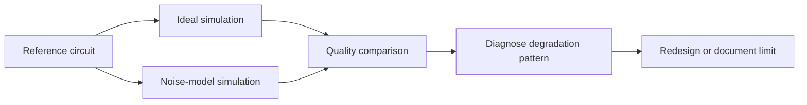

# Chapter 06: Noise Models and Error Interpretation

## Plain-English First
Noise is unavoidable on real hardware. This chapter teaches how to measure degradation and decide whether a circuit is robust enough.

## How to Use This Chapter
Read this chapter first, then open [Notebook 06](../notebooks/intermediate/notebook-06-noise-models.ipynb) to compare ideal and noisy runs.

## Quick Terms in this Chapter
| Term | Simple meaning |
|---|---|
| Noise model | Approximation of hardware imperfections |
| Readout error | Measurement output corruption |
| Decoherence | State quality loss over time |
| Degradation | Quality drop from ideal to noisy runs |

## Evaluation Lens
What structured error mechanism plausibly caused the quality loss, and does the circuit remain useful under that documented noise assumption?

## Visual Learning Map


## 1-minute overview
Noise models approximate hardware imperfections so you can test robustness before expensive hardware runs.

## Why this chapter matters
Quantum circuits that pass in ideal simulation may fail under realistic noise. Evaluation must quantify degradation.

The goal is not to remove all noise. The goal is to measure noise impact clearly and choose designs that remain useful under constraints.

## Noise concept table

| Noise factor | Practical impact | What to monitor |
|---|---|---|
| Readout error | Incorrect measurement bits | Outcome distribution drift |
| Gate error | Imperfect gate operations | Fidelity drop and leakage |
| Decoherence | State quality degrades over time | Deeper circuits degrade faster |

## How Noise Enters a Circuit
Noise is not one number. Different mechanisms act at different points in the workflow:
1. **Preparation error** means the initial state differs from the intended state.
2. **Gate error** applies an imperfect transformation during an operation.
3. **Decoherence** causes the state to lose useful quantum information while it waits or while gates run.
4. **Readout error** changes the classical bit reported by measurement.

Depolarizing-style noise tends to flatten a distribution toward uniform outcomes. Amplitude damping tends to bias a qubit toward $|0\rangle$. Readout error can create a misleading result even when the circuit state before measurement was correct. Diagnose the distribution pattern before deciding which mitigation or redesign is appropriate.

### Noise models are hypotheses
A simulator noise model is useful only when its assumptions are documented. It may use average gate and readout error rates, while a real device has qubit-specific errors, connectivity constraints, crosstalk, and calibration drift. Treat a noisy simulation as a sensitivity analysis, not a guarantee of hardware performance.

## Coherence Times and Noise Channels

$T_1$ is an energy-relaxation time: an excited qubit tends to decay from $|1\rangle$ toward $|0\rangle$. $T_2$ is a phase-coherence time: the relative phase between components becomes unreliable even when the population has not fully relaxed. In ordinary physical settings, $T_2$ cannot exceed $2T_1$.

Noise channels describe structured transformations, not merely random wrong answers:

| Channel | Signature | Simple diagnostic intuition |
|---|---|---|
| Bit flip | Exchanges 0 and 1 populations | Deterministic output appears on the opposite bit |
| Phase flip | Changes relative phase | Immediate Z-basis counts can look unchanged; interference fails |
| Depolarizing | Drives the state toward a mixed distribution | Distinct outcomes flatten toward uniform |
| Amplitude damping | Relaxes toward $|0\rangle$ | Excess 0 outcomes, especially after delay or depth |
| Readout error | Corrupts reported classical bits | Error is concentrated at measurement rather than circuit evolution |

Coherent errors, crosstalk, leakage outside the computational subspace, and calibration drift can produce patterns that simple independent-channel models miss. A noise model is most useful when it states what it deliberately does *not* model.

## Kraus Operators: The Mechanism Behind a Noise Channel

A unitary gate transforms a pure state precisely. A noisy operation instead transforms a **density matrix**, the more general object that describes both pure states and statistical mixtures. A set of Kraus operators $\{K_i\}$ describes one such operation:

$$
\rho \mapsto \sum_i K_i \rho K_i^\dagger
$$

The completeness condition $\sum_i K_i^\dagger K_i = I$ guarantees total probability is preserved. You do not need to compute Kraus operators during course exercises, but the picture gives useful intuition:

| Channel | Number of Kraus operators | Physical meaning |
|---|---|---|
| Unitary gate | 1 | Perfect, deterministic transformation |
| Bit flip with probability $p$ | 2 | Each shot is either unaffected or flipped |
| Depolarizing with parameter $p$ | 4 | State is replaced by a random Pauli error with weight $p$ |
| Amplitude damping | 2 | Energy loss toward ground state $|0\rangle$ |

The key insight is that a noisy operation is a **statistical mixture of transformations**, one applied per physical shot. What you observe in counts is the average over many such outcomes. Diagnosing a noise channel from counts is therefore always partially underdetermined: different Kraus representations can produce the same observable distribution.

### Process tomography and its cost

Full **quantum process tomography** recovers all Kraus operators by preparing many input states, applying the channel, and measuring in many bases. The cost scales as $4^n$ experiments for $n$ qubits, which becomes impractical quickly. For this course, the practical alternative is to characterize a small number of diagnostic circuits that are sensitive to the suspected dominant error, measure the distribution shift, and use that as a bounded description of the noise environment.

## Degradation metrics

| Metric | Definition | Interpretation |
|---|---|---|
| Quality drop percent | $(Q_{ideal} - Q_{noisy}) / Q_{ideal}$ | Relative robustness loss |
| Decision flip rate | Fraction of runs where pass changes to investigate | Operational stability risk |
| Leakage growth | Increase in unexpected outcomes | Error propagation indicator |

## Evaluation pattern
1. Run ideal simulation.
2. Run noisy simulation with same circuit and shots.
3. Compare key metrics (fidelity proxy, leakage, decision stability).

Keep the circuit, transpilation settings, measurement mapping, shots, seeds where applicable, and scoring rule fixed. If two or more of these change, the observed delta cannot be attributed to noise alone.

## Practical code pattern (noise comparison)

```python
def degradation_percent(ideal_score, noisy_score):
	if ideal_score == 0:
		return None
	return (ideal_score - noisy_score) / ideal_score
```

Use this with fixed circuit, fixed shots, and repeated runs.

## Practical lab
Notebook target: notebook-06-noise-models.ipynb

Minimum outputs:
1. Ideal vs noisy side-by-side table
2. Degradation percentage metric
3. Recommendation: acceptable, tune, or redesign

Recommended additions:
4. Repeat-run variance in noisy mode
5. Decision flip count
6. Resource impact note (depth vs degradation)

## Real-world example
Cloud hardware preparation workflows often use noise simulation to estimate whether a candidate circuit is worth executing on limited hardware budget.

This avoids spending hardware credits on fragile candidates that already fail stability checks in realistic simulation.

## Interpretation rubric

| Outcome | Typical action |
|---|---|
| Low degradation, stable decision | Candidate is ready for hardware comparison |
| Moderate degradation, unstable decision | Tune circuit depth or gate pattern |
| High degradation, repeated decision flips | Redesign before hardware run |

## Common mistakes
1. Changing shots between ideal and noisy runs.
2. Using one noisy run and calling it representative.
3. Ignoring circuit depth when diagnosing degradation.

## Failure Modes
1. **Noise-as-randomness misconception:** different channels have different signatures and different mitigations.
2. **Overfitted noise model:** tuning a model until it matches one result does not validate its predictions elsewhere.
3. **Readout attribution error:** blaming gates for an error pattern caused primarily by measurement.
4. **Drift blindness:** applying stale calibration assumptions to a later hardware run.

## Checkpoint
1. Which metric best captures your circuit sensitivity to noise?
2. Why should shot count remain fixed when comparing ideal vs noisy runs?
3. What evidence is needed before escalating to hardware tests?

## Mini assignment
Take one circuit from Chapter 04 and create ideal vs noisy results across 5 repeats. Report degradation percent, leakage growth, and decision flip rate.
