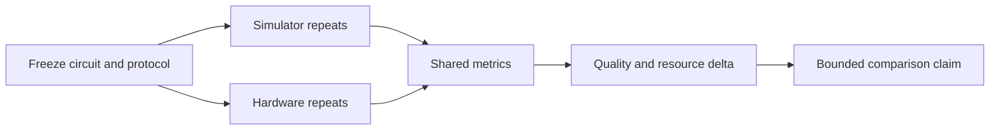

# Chapter 08: Simulator vs Hardware Comparison Design

## Plain-English First
This chapter teaches fair simulator vs hardware comparison. You will learn how to avoid misleading conclusions using controlled protocols.

## How to Use This Chapter
Read this chapter first, then open [Notebook 08](../notebooks/intermediate/notebook-08-simulator-vs-hardware.ipynb) to compare simulator and hardware-style outputs.

## Quick Terms in this Chapter
| Term | Simple meaning |
|---|---|
| Baseline | Reference result for comparison |
| Delta | Difference between simulator and hardware metrics |
| Control variable | Setting kept identical for fairness |
| Decision consistency | How often pass/fail decision is stable |

## Evaluation Lens
When protocol and metrics are held constant, how does device behavior differ from the simulator model, and is that difference operationally important?

## Visual Learning Map

## 1-minute overview
This chapter teaches fair comparison between simulator and hardware executions using controlled protocols.

## Why this chapter matters
Without controlled design, simulator-vs-hardware conclusions can be misleading.

The purpose is to identify practical utility under real constraints, not to chase a single impressive run.

## Fair comparison checklist

| Control variable | Requirement |
|---|---|
| Circuit definition | Keep identical |
| Shot count | Keep identical |
| Report format | Keep identical |
| Decision thresholds | Predefine before runs |
| Repeats | Use same repeat policy |

## Separate Three Different Questions
Simulator-versus-hardware studies often mix three questions that need different measurements:
1. **Does the circuit behave correctly?** Compare output quality against the expected distribution.
2. **Does the simulator predict device behavior?** Compare simulator and hardware distributions using the same metric.
3. **Is the hardware workflow practically useful?** Compare end-to-end quality, execution time, queue time, and cost against a classical baseline.

A low simulator-hardware delta does not establish a quantum speedup. Likewise, a long hardware queue does not mean the quantum circuit itself is slow. Keep compile time, queue time, execution time, and post-processing time as separate fields.

### Hardware context belongs in the record
For each hardware run, record backend name, calibration timestamp if available, qubit layout or transpilation settings, measurement mitigation status, and run time. Device calibration changes can explain differences between otherwise identical trials.

## From Logical Circuit to Physical Circuit

The circuit you write is logical: it names abstract qubits and general gates. A hardware backend has physical qubits, a limited coupling map, and a native basis-gate set. **Transpilation** rewrites the logical circuit for those constraints. It can decompose gates, choose physical qubits, reorder operations, and insert SWAP gates when two qubits that must interact are not connected.

For every simulator-versus-hardware comparison, capture the before-and-after resource record:

| Property | Logical circuit | Transpiled physical circuit |
|---|---|---|
| Depth | Before backend compilation | After routing and decomposition |
| Two-qubit gate count | Algorithm-level requirement | Includes routing overhead |
| Qubit layout | Abstract labels | Selected physical qubits |
| Basis gates | Gate model used in source | Backend-supported operations |

An increase in depth or two-qubit gates is not necessarily a bug; it is a cost of mapping the logical task to real connectivity. It does mean a direct comparison must state the transpiler settings and layout. Measurement mitigation and dynamical decoupling are additional protocol choices, not invisible defaults: report whether they were used and apply them consistently.

## Recommended experiment protocol
1. Freeze one circuit and one parameter set.
2. Define thresholds before execution.
3. Run simulator repeats first and record baseline spread.
4. Run hardware repeats with matching shots.
5. Compare deltas and decision consistency.
6. Record limitations and possible confounders.

If a noise-model simulator is used, state whether it is ideal, generic, or derived from a specific backend calibration. Do not compare an ideal simulator directly to hardware and call the difference “hardware error” without acknowledging the modeling gap.

## Comparison report table

| Metric | Simulator result | Hardware result | Delta | Interpretation |
|---|---|---|---|---|
| Core quality score | ... | ... | ... | ... |
| Leakage or error proxy | ... | ... | ... | ... |
| Runtime | ... | ... | ... | ... |
| Decision consistency | ... | ... | ... | ... |

## Delta interpretation guide

| Pattern observed | Likely explanation | Suggested action |
|---|---|---|
| Small quality delta, stable decisions | Hardware behaves close to model | Candidate is strong for next-stage tests |
| Moderate delta, occasional decision flips | Noise or calibration sensitivity | Tune depth and rerun controlled repeats |
| Large delta, frequent flips | Simulator assumptions not matching hardware | Revisit noise model and redesign circuit |

## Real-world example
Teams running limited cloud hardware allocations often pre-filter circuits on simulator benchmarks and only run top candidates on hardware to control cost.

This process reduces wasted credits and improves the reliability of final benchmark conclusions.

## Common mistakes
1. Comparing different shot counts across simulator and hardware.
2. Using a single hardware run as final proof.
3. Ignoring queue time and calibration context in runtime interpretation.

## Failure Modes
1. **Unequal compilation:** comparing an optimized physical circuit with an untranspiled simulator circuit obscures the source of the delta.
2. **Layout drift:** different physical-qubit choices can change error exposure between runs.
3. **Queue-time confusion:** queue delay affects workflow latency but is not circuit execution time.
4. **Unreported mitigation:** applying error mitigation only to one condition invalidates a fair comparison.

## Checkpoint
1. Which results are expected to diverge the most and why?
2. How do you avoid over-claiming speedup from one hardware run?
3. What minimum reproducibility evidence should accompany your comparison?

## Mini assignment
Create one simulator-vs-hardware report for a two-qubit benchmark circuit using matched shots and 3 to 5 repeats. Include delta analysis and final recommendation.
