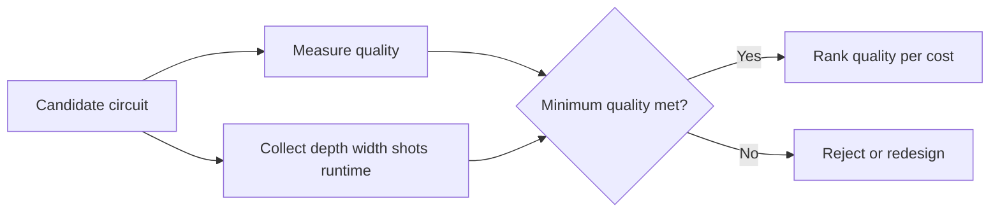

# Chapter 09: Resource Metrics - Depth, Width, Shots, Runtime

## Plain-English First
Good quality alone is not enough. This chapter shows how depth, width, shots, and runtime define practical feasibility.

## How to Use This Chapter
Read this chapter first, then open [Notebook 09](../notebooks/advanced/notebook-09-resource-metrics.ipynb) to score resource tradeoffs.

## Quick Terms in this Chapter
| Term | Simple meaning |
|---|---|
| Width | Number of qubits used |
| Depth | Sequential gate complexity |
| Runtime | Execution duration |
| Efficiency | Quality achieved per unit cost |

## What You Should Remember in 30 Seconds
1. Know the core terms before running experiments.
2. Use repeated runs and clear thresholds for decisions.
3. Report both quality and cost, not quality alone.

## Visual Learning Map

## 1-minute overview
Resource metrics explain the compute cost of quantum workflows and are essential for practical benchmarking.

## Why this chapter matters
A model or algorithm with good quality but excessive resource use may be impractical.

Professional benchmarking always reports quality and cost together. High quality without feasible resource use does not translate to utility.

## Resource metrics table

| Metric | Meaning | Why it matters |
|---|---|---|
| Depth | Sequential operation length | Higher depth often increases noise impact |
| Width | Number of qubits used | Affects feasibility on target hardware |
| Shots | Repetitions for probability estimates | Controls confidence and cost |
| Runtime | Execution time | Important for throughput and scaling |

## Derived efficiency metrics

| Metric | Formula | Interpretation |
|---|---|---|
| Quality per second | $Q / T$ | Quality gained per runtime unit |
| Quality per 1000 shots | $Q / (shots/1000)$ | Sampling efficiency |
| Depth-adjusted quality | $Q / depth$ | Robustness vs circuit complexity |

Where $Q$ can be fidelity proxy, success probability, or objective score.

## Resource Metrics Need Context
Depth is a count of sequential operation layers after a specified circuit decomposition. Two circuits with the same depth can have very different error exposure if one uses noisier two-qubit gates or maps poorly to the device connectivity. Width tells you the number of qubits required, but not whether those qubits are available or well calibrated on a chosen backend.

Runtime must be decomposed before comparison. Record at least compilation or transpilation time, queue time when applicable, quantum execution time, and classical post-processing time. Queue time affects user experience and cost planning, while execution time is the more relevant quantity for scaling a circuit itself.

### Avoid misleading ratio scores
Ratios such as $Q/T$ are useful for ranking candidates only when $Q$ has the same scale and meaning for every candidate. They can hide unacceptable absolute quality: a very fast but low-quality circuit may have a high ratio. Use a two-stage decision rule: first require minimum acceptable quality, then compare quality-per-cost among candidates that pass.

## Practical workflow
1. Pick two or more candidate circuits for the same task.
2. Keep target objective and thresholds identical.
3. Collect depth, width, shots, runtime, and quality metric.
4. Compute at least one efficiency metric.
5. Rank candidates by quality and by quality-per-cost.

## Reporting template

| Candidate | Depth | Width | Shots | Runtime (s) | Quality score | Quality/second | Decision |
|---|---:|---:|---:|---:|---:|---:|---|
| A | ... | ... | ... | ... | ... | ... | ... |
| B | ... | ... | ... | ... | ... | ... | ... |
| C | ... | ... | ... | ... | ... | ... | ... |

## Evaluation policy
1. Report quality with resource cost together.
2. Compare alternatives on quality-per-cost, not quality alone.
3. Keep measurement budgets explicit.

For noisy hardware, also report the number of two-qubit gates, because they often dominate error exposure more directly than total gate count.

## Real-world interpretation pattern

| Scenario | Typical decision |
|---|---|
| Small quality gain, large runtime penalty | Usually reject for production |
| Moderate quality gain, minor runtime cost | Candidate for deeper testing |
| Stable quality with lower depth | Preferred under noisy hardware constraints |

## Real-world example
In scheduling and optimization pilots, teams often choose slightly lower quality configurations if runtime and stability are significantly better under production constraints.

This is common when SLA or batch throughput matters more than marginal objective improvement.

## Common mistakes
1. Comparing circuits with different quality metrics.
2. Ignoring shot-cost in repeated experiments.
3. Reporting runtime without backend details.

## Checkpoint
1. Which resource metric is your current bottleneck?
2. How do you define acceptable quality-per-cost for your task?
3. What tradeoff would you choose for a latency-sensitive scenario?

## Mini assignment
Build a three-candidate comparison table for one task and justify the final selection using both quality and efficiency metrics.
