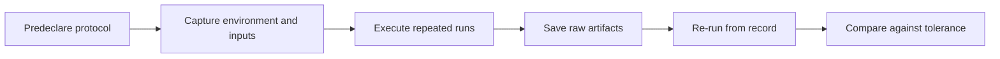

# Chapter 10: Reproducible Benchmark Methodology

## Plain-English First
Reproducibility turns experiments into evidence. This chapter gives you a repeatable method so others can validate your benchmark claims.

## How to Use This Chapter
Read this chapter first, then open [Notebook 10](../notebooks/advanced/notebook-10-reproducible-benchmarks.ipynb) to build the reproducibility bundle.

## Quick Terms in this Chapter
| Term | Simple meaning |
|---|---|
| Reproducibility | Ability to recreate same result |
| Protocol | Predefined run and scoring procedure |
| Artifact | Saved file proving experiment details |
| Drift | Unexpected change across reruns |

## Evaluation Lens
Can an independent learner reconstruct the protocol, rerun it, and reach the same decision within a declared tolerance?

## Visual Learning Map


## 1-minute overview
Reproducibility turns benchmark results from anecdote into evidence.

## Why this chapter matters
Without reproducibility, performance claims cannot be trusted or compared.

Reproducibility is the difference between a demo and evidence.

## Reproducibility checklist

| Item | Requirement |
|---|---|
| Environment | Pin package versions |
| Inputs | Save circuit definitions and parameters |
| Randomness | Set and report seeds when supported |
| Protocol | Document shot counts, repeats, and thresholds |
| Output | Store raw counts and summary tables |

## Minimum artifact package

| Artifact | Example file |
|---|---|
| Run configuration | `artifacts/run_config.json` |
| Raw counts | `artifacts/raw_counts.csv` |
| Summary table | `artifacts/summary_metrics.csv` |
| Notebook or script | `notebooks/...` or `scripts/...` |
| Environment snapshot | `requirements.txt` and Python version note |

Use the repository [manifest template](../projects/templates/benchmark_manifest.template.json) for every serious run and append one summary row to the cumulative [benchmark log](../projects/templates/benchmark_log.csv). Copy these templates into your experiment artifact folder before filling them out; do not overwrite the repository examples.

### Required manifest fields

A publication-quality manifest must identify the source revision, Python and package versions, backend and calibration context, circuit hash or source path, transpiler configuration, shots, repeats, seeds, noise model, metrics, thresholds, decision rule, and artifact paths. These fields allow another person to distinguish a changed protocol from normal stochastic variation.

## Protocol-first rule
Define this before execution:
1. Success metric and threshold.
2. Shot count and number of repeats.
3. Candidate configurations to test.
4. Decision rule for pass or investigate.

Changing these after looking at outcomes introduces bias.

## Reproducible Does Not Always Mean Identical
For stochastic algorithms and quantum hardware, a correct rerun may not reproduce every count exactly. The reproducible object is the protocol: the same environment, inputs, configuration, analysis, and decision rule should produce results within a declared tolerance.

Define the tolerance before rerunning. For example, a simulator benchmark may require an identical decision plus a TVD change no larger than $0.02$, while a hardware study may permit a wider range due to calibration drift. A failed reproduction is evidence, not an inconvenience: determine whether the cause is an environment change, protocol drift, sampling variation, or device change.

### Provenance checklist
Save these fields with every benchmark run:
1. Git commit or source version identifier.
2. Python, package, and backend versions.
3. Circuit source, transpilation settings, and random seeds where supported.
4. Start time, backend or simulator configuration, shots, and repeat index.
5. Raw outputs before aggregation.

## Publication-Grade Reproduction Workflow

For a result to be trustworthy beyond a single session, every step that could vary must be recorded before anyone interprets the output.

### Step 1: Write the protocol document
Before running any code, produce a short protocol document containing: the research question, candidate configurations, primary and secondary metrics, success thresholds, shot count, repeat count, exclusion criteria, and the classical baseline definition.

### Step 2: Capture the environment snapshot
```python
import sys, importlib.metadata, datetime, json, subprocess

def capture_env(output_path="artifacts/env_snapshot.json"):
    pkgs = {d.name: d.version for d in importlib.metadata.distributions()}
    try:
        rev = subprocess.check_output(["git", "rev-parse", "HEAD"],
                                      text=True).strip()
    except Exception:
        rev = "unavailable"
    snapshot = {
        "timestamp_utc": datetime.datetime.utcnow().isoformat() + "Z",
        "python": sys.version,
        "git_revision": rev,
        "packages": pkgs,
    }
    with open(output_path, "w") as f:
        json.dump(snapshot, f, indent=2)
    return snapshot
```
Save this before any circuit runs.

### Step 3: Run trials and save raw counts
Save one JSON or CSV row per (circuit, seed, repeat) before any aggregation. Never overwrite raw files with derived summaries.

### Step 4: Fill the manifest
Copy `projects/templates/benchmark_manifest.template.json` into the artifact folder, populate every field, and record the `git_revision` from the environment snapshot.

### Step 5: Aggregate and decide
Apply the protocol-defined metric, threshold, and decision rule to the raw rows. Do not adjust thresholds after viewing results.

### Step 6: Reproduction test
On a separate terminal with a freshly created virtual environment, install `requirements.txt` pinned to the captured versions, then re-execute the notebook or script from the recorded Git revision. Compare the new summary table against the original. Acceptable discrepancy is the predeclared tolerance.

### Step 7: Append to the benchmark log
Add one row to `projects/templates/benchmark_log.csv` summarizing the experiment ID, metric value, uncertainty, and decision. Link it to the manifest file path.

## Practical workflow
1. Define benchmark protocol before execution.
2. Run repeated trials with fixed settings.
3. Save artifacts and summary report.
4. Re-run on fresh environment for verification.

For hardware work, a fresh environment alone is insufficient. Repeat at a different time and compare against recorded backend calibration information.

## Reproducibility validation checklist

| Check | Pass condition |
|---|---|
| Environment reproduction | Fresh setup runs successfully |
| Data consistency | Raw counts align with summary metrics |
| Protocol consistency | Threshold and repeat policy unchanged |
| Decision reproducibility | Same protocol yields same decision class |

## Real-world example
Research and industry benchmark teams commonly require run sheets and artifact logs before accepting performance claims for internal review.

In practice, teams often reject strong claims that cannot be rerun in a clean environment within a defined tolerance.

## Common mistakes
1. Saving only charts and not raw data.
2. Omitting shot counts or random seed details.
3. Mixing results from changed protocols in one summary.

## Failure Modes
1. **Source ambiguity:** a notebook file without a Git commit or source revision cannot identify the code that generated a result.
2. **Configuration drift:** changed transpiler options, backend calibration, or package versions can invalidate a direct comparison.
3. **Artifact-only reporting:** a chart without raw counts and a manifest cannot be independently audited.
4. **Log inconsistency:** a benchmark-log row must point to the raw artifacts and manifest that support its decision.

## Checkpoint
1. Which artifact is most likely to be missing in beginner reports?
2. What minimum information allows another learner to replicate your result?
3. How would you detect accidental environment drift?

## Mini assignment
Create a reproducibility bundle for one Chapter 08 comparison experiment, then validate it in a clean environment and record any drift.
