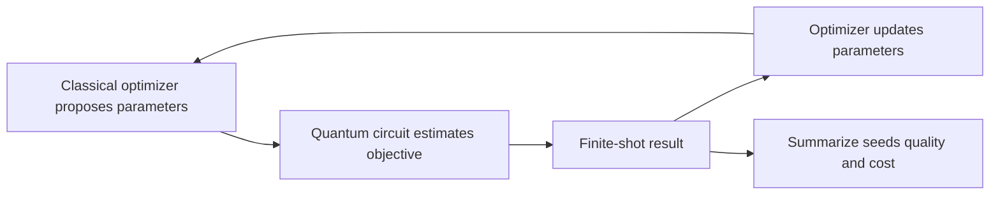

# Chapter 11: VQE and QAOA Evaluation Patterns

## Plain-English First
Variational methods can look good by chance. This chapter teaches stable evaluation of VQE and QAOA using repeated runs and cost-aware scoring.

## How to Use This Chapter
Read this chapter first, then open [Notebook 11](../notebooks/advanced/notebook-11-vqe-qaoa-evaluation.ipynb) to evaluate the candidate runs.

## Quick Terms in this Chapter
| Term | Simple meaning |
|---|---|
| VQE | Variational method for energy-like objectives |
| QAOA | Variational method for combinatorial objectives |
| Seed sensitivity | Dependence on initialization |
| Robustness | Performance under noise and repeats |

## Evaluation Lens
Does the hybrid optimizer improve the actual objective consistently across seeds and noise, rather than exploiting a favorable stochastic run?

## Visual Learning Map


## 1-minute overview
This chapter defines a professional evaluation framework for VQE and QAOA style hybrid algorithms.

## Why this chapter matters
Variational algorithms can appear to improve while actually overfitting noise or optimizer quirks.

This chapter teaches how to evaluate these algorithms with repeatable evidence rather than one-off best runs.

## Evaluation pattern table

| Evaluation axis | VQE focus | QAOA focus |
|---|---|---|
| Objective behavior | Energy convergence | Cost function improvement |
| Stability | Sensitivity to initialization | Sensitivity to depth and optimizer |
| Resource use | Iterations, depth, runtime | Layers, shots, runtime |
| Robustness | Performance under noise shifts | Decision consistency under repeats |

## The Hybrid Optimization Loop
VQE and QAOA are not single circuits. They are iterative experiments. At iteration $t$, a classical optimizer proposes parameters $\theta_t$, the quantum circuit estimates an objective from finite shots, and the optimizer uses that noisy estimate to choose $\theta_{t+1}$. Evaluation therefore needs to measure both the final answer and the path taken to reach it.

For VQE, the target is commonly an energy expectation value. Lower energy is better, but compare it to a known reference or classical estimate when available. For QAOA, report the objective value and an approximation ratio when the task has a known optimum or valid bound. A raw score without the problem scale is difficult to interpret.

### Baselines and budget parity
A classical baseline should receive comparable tuning attention. State the solver, its settings, runtime budget, stopping rule, and solution quality. Do not compare a tuned quantum configuration to an untuned classical method, or a quantum run using thousands of objective evaluations to a classical run stopped after a few steps.

### Uncertainty from shots and seeds
Use multiple optimizer seeds and, where practical, multiple shot-seed or measurement-repeat settings. Summarize median, mean, spread, success rate, and worst-case outcome. The median is useful when rare optimizer failures make the mean unstable.

## Algorithm Mechanics: What Is Being Optimized?

VQE minimizes the expectation value of a Hamiltonian $H$ using a parameterized ansatz $|\psi(\theta)\rangle$:

$$
E(\theta)=\langle\psi(\theta)|H|\psi(\theta)\rangle
$$

The optimizer does not receive the exact $E(\theta)$ on hardware; it receives a finite-shot estimate assembled from measurements. The ansatz controls which states are reachable, while the optimizer controls which parameters are tried. A low final estimate is meaningful only when it is compared with a reference energy, uncertainty, and equivalent-budget baseline.

QAOA alternates a problem-specific cost operator with a mixer operator. Its parameters commonly appear as $\gamma$ and $\beta$, and layer count $p$ trades expressiveness against depth and optimization difficulty. For a maximization problem with known optimum $C^*$, report an approximation ratio such as $C/C^*$, not only a raw score whose scale changes with the problem instance.

### Optimizer failure modes are experimental outcomes

COBYLA, SPSA, and Nelder-Mead make different tradeoffs in noisy settings. Compare them only with the same maximum objective evaluations, shot policy, stopping rule, and initialization policy. Record runs that exhaust their budget, converge prematurely, or fail numerically. These are reliability findings, not rows to discard.

## Practical evaluation workflow
1. Choose one VQE-style or QAOA-style objective.
2. Run multiple initializations or parameter seeds.
3. Keep shot budget and runtime budget explicit.
4. Track best, mean, standard deviation, and failure cases.
5. Compare against at least one classical baseline.

## Scoring template

| Configuration | Best score | Mean score | Std dev | Runtime (s) | Quality per second | Decision |
|---|---:|---:|---:|---:|---:|---|
| config-a | ... | ... | ... | ... | ... | ... |
| config-b | ... | ... | ... | ... | ... | ... |

## Stability and robustness rules

| Signal | Interpretation | Typical action |
|---|---|---|
| High best, low mean | Unstable optimization | Increase repeats or adjust optimizer |
| Low variance, moderate score | Reliable candidate | Prefer for constrained deployments |
| Strong noise sensitivity | Fragile configuration | Reduce depth or redesign ansatz |

An ansatz is the parameterized circuit family. Increasing its depth may improve expressiveness, but it also adds parameters, optimization difficulty, and noise exposure. More expressive is not automatically more useful.

## Recommended reporting
1. Best score and average score across repeats.
2. Resource footprint per run.
3. Failure cases and sensitivity notes.
4. Baseline comparison against classical alternatives.

## Practical code pattern

```python
import pandas as pd

def summarize_runs(df, score_col="score", runtime_col="runtime_s"):
	out = {
		"best_score": df[score_col].max(),
		"mean_score": df[score_col].mean(),
		"std_score": df[score_col].std(),
		"mean_runtime": df[runtime_col].mean(),
	}
	out["quality_per_second"] = out["mean_score"] / out["mean_runtime"] if out["mean_runtime"] else None
	return out
```

## Real-world example
Hybrid optimization experiments in operations and scientific domains typically evaluate multiple optimizer settings and initialization seeds before selecting a deployable configuration.

Teams usually reject configurations that only succeed under narrow initialization conditions.

## Common mistakes
1. Publishing only the single best run.
2. Ignoring failed runs in averages.
3. Comparing configurations with different budget limits.

## Failure Modes
1. **Seed dependence:** a favorable initialization can look like an algorithmic improvement.
2. **Shot-noise chasing:** the optimizer may react to estimator noise rather than a real objective change.
3. **Barren or flat regions:** gradients or score differences may become too small to guide useful updates.
4. **Unfair classical baseline:** an untuned classical solver does not establish a meaningful quantum comparison.

## Checkpoint
1. Which axis is most important for your target use case?
2. What sensitivity test should always be included?
3. How do you present robustness without hiding failure cases?

## Mini assignment
Run at least three parameter configurations with identical compute budget and produce a ranking using mean score, std deviation, and quality-per-second.
