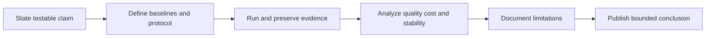

# Chapter 12: Capstone Benchmarking Study

## Plain-English First
This is your end-to-end benchmark project chapter. You will combine methodology, metrics, reproducibility, and clear reporting into one capstone.

## How to Use This Chapter
Read this chapter first, then open [Notebook 12](../notebooks/advanced/notebook-12-capstone-template.ipynb) to assemble the final report.

## Quick Terms in this Chapter
| Term | Simple meaning |
|---|---|
| Capstone | Final end-to-end benchmark project |
| Methodology | How experiment is designed and run |
| Limitation | Known boundary of your claim |
| Executive summary | Short result and decision overview |

## Evaluation Lens
Does the complete evidence package support the stated claim, including its limitations, negative findings, and comparison baseline?

## Visual Learning Map

## 1-minute overview
The capstone consolidates all prior chapters into a full benchmark study with evidence, tradeoffs, and reproducibility artifacts.

## Capstone objective
Evaluate one quantum workflow end-to-end and produce a publishable-style report.

The capstone should demonstrate disciplined evaluation, not only technical implementation.

## Frame a Claim That Evidence Can Support
Start with a narrow, testable claim. For example: “For this two-qubit task, under this shot budget and simulator noise model, configuration A achieved lower TVD than configuration B.” This is stronger than “configuration A is better” because it states the task, budget, metric, and execution conditions.

Your conclusion should distinguish three levels of evidence:
1. **Correctness evidence:** the circuit and scoring code behave as expected on a controlled reference.
2. **Performance evidence:** one candidate meets a declared quality and resource criterion better than its baseline.
3. **Generalization evidence:** the result remains stable across repeats, instances, or execution contexts.

Most course capstones can establish the first two. Do not claim general quantum advantage unless the experiment genuinely supports the much stronger third level against a competitive classical baseline.

### Plan the experiment before the result exists
Write the problem instance, candidate configurations, primary metric, secondary metrics, quality threshold, repeat count, shot budget, exclusion criteria, and comparison baseline before the main run. This makes negative results interpretable and prevents unintentional selection of only favorable trials.

## Capstone structure

| Section | Required content |
|---|---|
| Problem statement | Task definition and success metrics |
| Baselines | Classical and quantum baseline setup |
| Methodology | Protocol, thresholds, repeats, and constraints |
| Results | Quality, resource cost, and significance evidence |
| Discussion | Tradeoffs, limitations, and failure analysis |
| Reproducibility | Environment, scripts, and artifact index |

## Required Research-Style Report

Submit the report in this order so a reviewer can trace every conclusion back to the method and raw evidence:

1. Executive summary and bounded claim.
2. Research question and hypothesis.
3. Problem definition and task instance.
4. Classical and quantum baselines.
5. Experimental protocol and configuration manifest.
6. Metrics, uncertainty method, and decision thresholds.
7. Results and resource analysis.
8. Negative result and failure analysis.
9. Reproducibility artifact index.
10. Limitations and conclusion.

### A negative result is required

Include at least one planned configuration that did not meet its predeclared success rule, then explain the likely reason using evidence. Examples include a circuit that exceeded a TVD threshold, a variational configuration that was seed-sensitive, or a transpiled circuit whose resource overhead made it impractical. This requirement prevents a capstone from becoming a search for one favorable chart.

## Step-by-step capstone flow
1. Select one practical task with measurable success criteria.
2. Define quantum and classical baselines before experimentation.
3. Establish thresholds, repeat policy, and budget constraints.
4. Execute benchmark runs and save raw artifacts.
5. Analyze quality, cost, and statistical stability.
6. Write conclusions bounded to tested scope.

## Required result tables

| Table | Purpose |
|---|---|
| Main benchmark table | Compares candidate configurations |
| Reproducibility table | Verifies repeated-run consistency |
| Cost-performance table | Shows quality-per-cost tradeoffs |
| Limitation table | Documents known constraints and risks |

## Minimum evidence checklist
1. At least 3 repeated runs per key configuration.
2. Explicit pass or investigate criteria.
3. Resource metrics reported with quality metrics.
4. One classical baseline comparison.

Add uncertainty to the main table: confidence interval, standard deviation, or robust quantiles. State why the selected summary is appropriate for the distribution of runs.

## Grading rubric (recommended)

| Dimension | Points |
|---|---:|
| Methodology rigor | 30 |
| Quality and correctness of analysis | 25 |
| Reproducibility artifacts | 20 |
| Cost-performance reasoning | 15 |
| Communication clarity | 10 |

Total: 100 points

## Real-world example
Professional benchmark documents in applied research often include negative results and limitation sections; this increases trust and decision quality.

Well-documented negative findings are often more useful than unverified positive claims.

## Common mistakes
1. Making broad claims from narrow test scope.
2. Omitting baseline details.
3. Reporting conclusions without uncertainty or limitation notes.
4. Treating a simulator result as proof of hardware utility.
5. Calling a result a speedup without an equal-budget classical comparison.

## Final checkpoint
1. Can another person reproduce your main table with your artifacts?
2. Did you report both strengths and limitations?
3. Is your final claim bounded to the tested scope and budget?

## Capstone submission bundle
1. Final report markdown file
2. Notebook and script artifacts
3. Raw and processed metric files
4. Completed [benchmark manifest](../projects/templates/benchmark_manifest.template.json) and cumulative [benchmark log](../projects/templates/benchmark_log.csv)
5. One-page executive summary
