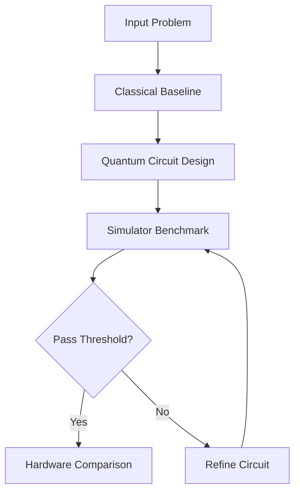

# Visuals and Animation Guide

Use this guide to add visual flow and better learning UX to MeeTARA QC.

## 1. Circuit diagrams (recommended)

Use Qiskit built-in drawers for fast visual explanations.

```python
from qiskit import QuantumCircuit

qc = QuantumCircuit(2)
qc.h(0)
qc.cx(0, 1)

# Text diagram in notebook output
print(qc.draw("text"))

# Matplotlib diagram (clean for docs/screenshots)
qc.draw("mpl")
```

## 2. Flow diagrams in markdown (GitHub rendering)

In README or chapter markdown, use Mermaid blocks.



Tip: Mermaid renders on GitHub markdown pages, but not always inside notebook markdown preview.

## 3. Static images in chapters and README

Create an assets folder and reference images with relative paths.

Suggested structure:
- assets/images/
- assets/diagrams/
- assets/gifs/

Markdown example:
```markdown

```

## 4. Notebook-friendly animations

### Option A: Matplotlib animation (GIF/HTML)
```python
import numpy as np
import matplotlib.pyplot as plt
from matplotlib.animation import FuncAnimation

fig, ax = plt.subplots()
x = np.linspace(0, 2*np.pi, 200)
line, = ax.plot(x, np.sin(x))

def update(frame):
    line.set_ydata(np.sin(x + frame/10))
    return line,

ani = FuncAnimation(fig, update, frames=60, interval=80)
plt.close(fig)
ani
```

### Option B: Plotly interactive animations
Use plotly for smoother interactive transitions and slider controls.

## 5. Quantum-state visual aids

Use these visual helpers in notebooks:
1. Histogram of counts for measurement distributions.
2. Bloch sphere plots for single-qubit state intuition.
3. Circuit depth and gate-count tables for cost interpretation.

## 6. Recommended visual policy for this repo

For each chapter notebook:
1. One concept diagram (flow or architecture).
2. One circuit diagram.
3. One output chart (histogram or line chart).
4. One benchmark table with pass/fail coloring.

## 7. Lightweight visual stack (credit and runtime friendly)

Use local and low-cost tools first:
1. Matplotlib for plots and simple animation.
2. Mermaid for markdown flowcharts.
3. Qiskit built-in circuit drawing.
4. Avoid heavy web animation frameworks until public docs phase.

## 8. Suggested next additions

1. Add assets/diagrams/benchmark-pipeline.mmd and export PNG.
2. Add one visual flow per chapter in chapters/.
3. Add a small GIF in README showing simulator benchmark loop.
