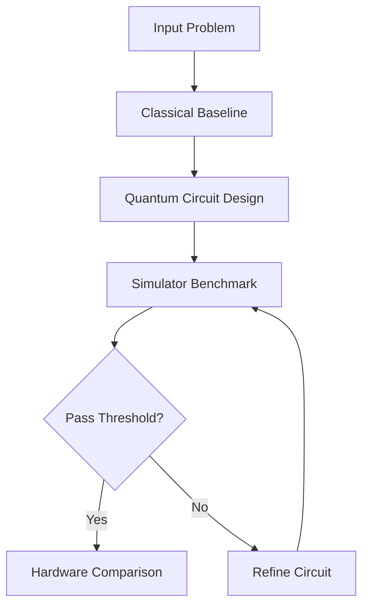

# Visuals and Animation Guide

Use this guide to add visual flow and better learning UX to meeTARA QC.

## 1. Circuit diagrams (recommended)

Use Qiskit built-in drawers for fast visual explanations.

```python
from qiskit import QuantumCircuit

qc = QuantumCircuit(2)
qc.h(0)
qc.cx(0, 1)

# Text diagram in notebook output
print(qc.draw("text"))

# Matplotlib diagram (clean for docs/screenshots)
qc.draw("mpl")
```

## 2. Flow diagrams in markdown (GitHub rendering)

In README or chapter markdown, use Mermaid blocks.



Tip: Mermaid renders on GitHub markdown pages, but not always inside notebook markdown preview.

## 3. Static images in chapters and README

Create an assets folder and reference images with relative paths.

Suggested structure:
- assets/images/
- assets/diagrams/
- assets/gifs/

Markdown example:
```markdown

```

## 4. Notebook-friendly animations

### Option A: Matplotlib animation (GIF/HTML)
```python
import numpy as np
import matplotlib.pyplot as plt
from matplotlib.animation import FuncAnimation

fig, ax = plt.subplots()
x = np.linspace(0, 2*np.pi, 200)
line, = ax.plot(x, np.sin(x))

def update(frame):
    line.set_ydata(np.sin(x + frame/10))
    return line,

ani = FuncAnimation(fig, update, frames=60, interval=80)
plt.close(fig)
ani
```

### Option B: Plotly interactive animations
Use plotly for smoother interactive transitions and slider controls.

## 5. Quantum-state visual aids

Use these visual helpers in notebooks:
1. Histogram of counts for measurement distributions.
2. Bloch sphere plots for single-qubit state intuition.
3. Circuit depth and gate-count tables for cost interpretation.

## 6. Recommended visual policy for this repo

Each chapter now includes one **Visual Learning Map**: a Mermaid flowchart placed after the 30-second summary. It should answer one question: *how does this chapter's idea become evidence or a decision?* These diagrams are intentionally conceptual rather than decorative, so a learner can scan the course before reading the mathematics or code.

For each associated notebook:
1. One Qiskit circuit drawing that matches the chapter's central operation.
2. One output chart, usually a histogram, distribution comparison, or convergence plot.
3. One benchmark table with pass/fail interpretation.
4. One short prediction prompt before the code cell that reveals the answer.

### Chapter visual map

| Chapter | Markdown visual | Notebook visual to add or preserve |
|---|---|---|
| 00 | Classical-to-hybrid decision path | Hybrid workflow comparison diagram |
| 01 | Preparation, measurement, and repeated shots | Bloch sphere plus measurement histogram |
| 02 | Gates to entanglement to outcomes | Single- and two-qubit circuit drawings |
| 03 | Shots to probability estimate to uncertainty | Histogram at multiple shot counts |
| 04 | Simulator benchmark decision loop | Identity, X, and H circuit diagrams with counts |
| 05 | Expected versus observed distribution scoring | Side-by-side distributions with TVD or overlap |
| 06 | Ideal versus noisy comparison path | Noise degradation histogram or line chart |
| 07 | Candidate evaluation under a shared budget | Success or convergence versus cost plot |
| 08 | Controlled simulator and hardware comparison | Delta chart with shared metrics |
| 09 | Quality threshold followed by cost ranking | Quality-versus-resource scatter plot |
| 10 | Protocol to artifact to rerun flow | Reproducibility artifact tree or manifest |
| 11 | Classical optimizer and quantum objective loop | Objective convergence across multiple seeds |
| 12 | Claim-to-evidence capstone workflow | Final quality, cost, and stability summary chart |

### Mermaid authoring pattern

Use a compact left-to-right flow and keep node labels short. Mermaid is rendered by GitHub, which makes it the default for chapter documentation. Test any diagram in GitHub Markdown preview after editing.


## 7. Lightweight visual stack (credit and runtime friendly)

Use local and low-cost tools first:
1. Matplotlib for plots and simple animation.
2. Mermaid for markdown flowcharts.
3. Qiskit built-in circuit drawing.
4. Avoid heavy web animation frameworks until public docs phase.

## 8. Suggested next additions

1. Add Qiskit circuit drawings and output plots to the notebooks according to the chapter visual map.
2. Add a small GIF or short screen recording in the README showing the simulator benchmark loop.
3. Render-review Mermaid diagrams on GitHub after any Markdown-platform change.
